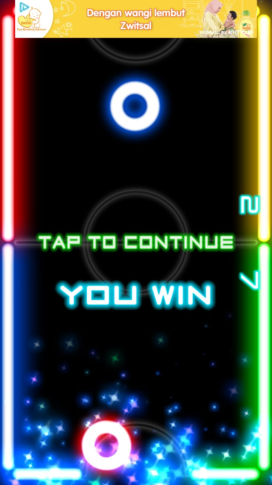

# assignment-1-game-review-zikrulihsan
assignment-1-game-review-zikrulihsan created by GitHub Classroom

Game Review, by Zikrul Ihsan 05111850010045

# Glow Hockey, New way to play Air hockey
Glow hockey is an mobile game based that simulate the air hockey game.  You can get it on play store or apps store. you can play it by your self againts computer in 4 different level. or you can play it with your friends at the same device by using the 2 player mode.
The difference is that every thing this game is a glow material, so you can play it with a different sensation of playing air usual hockey.

## 1. Basic Component of the game
### 1.a. The Gamespace
A full screen of the mobile device that represent the table of air hockey game.

### 1.b. Boundaries
- Wall as the boundaries of the pucks
- Center line as the boundaries of each attacker movement area.

### 1.c. Rule Of Interactions
- Each player has one hitter to move
- The puck is moving when the hitter is touching it
- Every time the puck hit the wall, it will give a reflective effect

### 1.d. Goals
The goal of this game is to be the first to score 7 points

### 1.e. Artifacts
1. Hockey puck      
2. Hitter/striker
3. Wall
4. 2 slot
5. Table
6. Center line
7. The Scores
8. Circle line
9. Menu

## 2. GAMEPLAY
## 2.a Game Rules
- The Game is a 1 vs 1 game
- Each player has their own area, so they can not touching or doing anything to the pucks except when the pucks is in their area
- The Game is Ended when one of the player reach maximum score

## 2.b Plot
#### _"You are an hockey athletes that compete to your opponent to win the match, here is the detail flow:"
1. When the game starts, the hockey appears in the middle of the table, both players scramble to be able to hit the first ball that
2. Players can freely hit the puck, there is no out rules
3. Every time the pucks goes to the slot/goal, the other side scores is added and appear 
4. After a player scores, the game is showing a "goal" state the pucks reappeared at their own area, where it is placed at the circle line
5. Repeat process untill one of the player get the score to 7, and you win or you lose text will appear based on both final score

## 2.c Objectives
- Every player must save their own slot to keep the pucks goes into their own slot 
- Every player score as fast as he can to reach maximum score

## 2.d Chalenges
a. Championship
is a continous game, where we have to fight the computer player with an Artificial intelegence from a game to the other game. The computer have a different difficulty, level to level.
b. 1 player
is a versus game with a AI hitter that move and hit a ball according to the difficulty we choose.
- Easy
The opponents movement is not so responsive
- Medium
The opponents movement is more responsive than easy mode and have a speed. 
- Hard
The opponents movement is so responsive and agressive and have the better speed from the medium and easy. 
- Insane
The opponents movement is so responsive and agressive and have the best speed from the other. Everytime the hitter hit the puck, it almost always goes to the slot. And the keeping skill is really impressive. It is faster than Hard mode.

c. 2 Player
- The chalenges is that you have to face the real opponents that possibly give you the psychology effect.

## 3. Game Mechanic
#### 3.a. Player move
In this game, the player move is done by touching screen in their area to move the hitter. The hitter/striker movement is based on  the direction of the player's finger movements
#### 3.b Hitter Hit 
Hitter can possibly hit the ball by using collision between two objects (hitter and pucks)
#### 3.c The puck moving speed and direction
Based on the action-reaction process after a puck and the hitter collise
#### 3.d The reflection from the wall
Every time the puck touching the wall, it will give the reflective effect 

